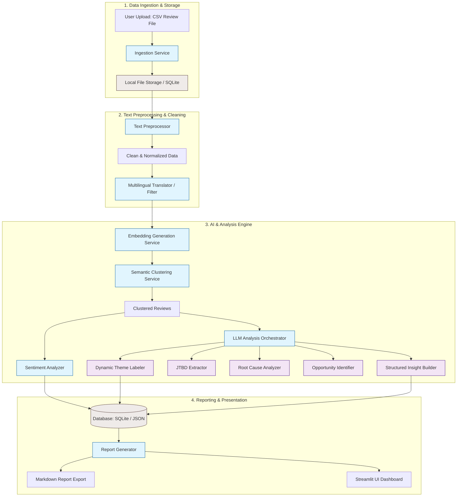
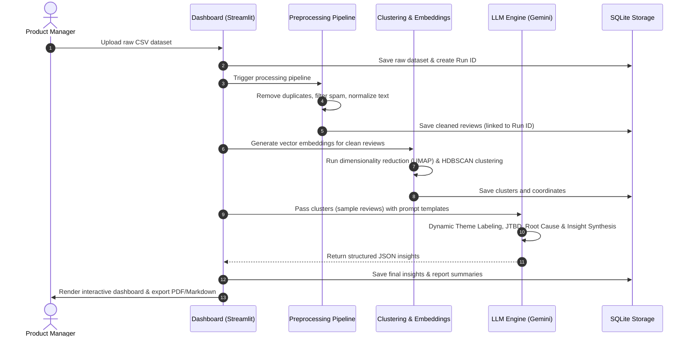

# 🏗️ Blinkit Insight AI — System Architecture

> **Document Type:** System Architecture Design  
> **Project:** Blinkit Insight Analyser  
> **Status:** Draft / Proposal  
> **Target Version:** MVP (v1.0.0)

---

## 1. Executive Summary

Blinkit Insight AI is an AI-powered research assistant designed to help Growth Product Managers understand customer behavior, identify cross-category purchase barriers, and discover growth opportunities. 

The system automates the ingestion of thousands of customer reviews, runs them through a cleaning and enrichment pipeline, clusters them semantically, performs LLM-driven root-cause and behavior analysis, and outputs structured, evidence-backed insights in a final PM Research Report.

---

## 2. System Architecture Diagram

Below is the conceptual architecture of the Blinkit Insight AI platform:



---

## 3. Component Breakdown

### 3.1 Data Ingestion Service
- **Purpose:** Ingest raw review data from multiple external sources.
- **MVP Implementation:** A file-upload handler accepting CSV and JSON files.
- **Validation:** Ensures presence of mandatory columns (review text, rating, timestamp, and source platform). 
- **Database Storage:** Saves raw records into an SQLite database with an ingestion execution ID to track runs.

### 3.2 Text Preprocessing & Cleaning Pipeline
- **Deduplication:** Uses hash matching on standardized review text to filter duplicates.
- **Spam Filtering:** Employs heuristics (e.g., character repetition, length constraints) and a lightweight classifier to remove noise/spam (e.g., "nice app", "good").
- **Language Detection:** Identifies non-English reviews and translates them using translation APIs (or a lightweight translation model) to ensure consistency in LLM analysis.

### 3.3 Sentiment Analysis Service
- **Objective:** Compute sentiment scores (Positive, Neutral, Negative) for each review.
- **MVP Implementation:** Uses a pretrained transformer model (e.g., CardiffNLP's Twitter RoBERTa for sentiment) or Gemini/LLM prompting. 
- **Metrics:** Captures polarity score and category distribution.

### 3.4 Semantic Clustering Service
To group similar reviews at scale without predefined categories:
1. **Embeddings Generation:** Reviews are passed through an embedding model (e.g., `text-embedding-004` from Gemini or `all-MiniLM-L6-v2` from SentenceTransformers) to generate dense vector representations.
2. **Clustering Algorithm:** Runs HDBSCAN or K-Means on the vectors to dynamically group semantically similar reviews (e.g., grouping mentions of "poor recommendations" and "irrelevant suggestions" together).
3. **Dimensionality Reduction:** Uses UMAP to project clusters into a 2D space for dashboard visualization.

### 3.5 LLM Analysis Orchestrator
Uses a state-of-the-art LLM (e.g., Gemini 1.5 Flash/Pro) to perform semantic synthesis over the clusters:
- **Theme Labeler:** Labels each cluster (e.g., "Delivery Delays", "App Crashing during Checkout") and generates a short summary of the cluster.
- **JTBD Extractor:** Analyzes user motivations in the cluster to construct Jobs-To-Be-Done statements.
- **Root Cause Analyzer:** Determines the underlying frictions causing negative/hesitant user sentiments.
- **Opportunity Identifier:** Proposes concrete product enhancements addressing the themes.
- **PM Insight Builder:** Merges the above findings into a structured format mapped back to supporting quotes (review IDs).

### 3.6 Reporting & Visualization Dashboard
- **Web Interface:** Built using Streamlit (Python) for fast prototyping and high visual quality.
- **Dashboard Features:**
  - File Uploader for new datasets.
  - Ingestion run history list.
  - Metrics layout showing Sentiment distribution, Cluster sizes, and Top Pain Points.
  - Interactive UMAP scatter plot of review clusters.
  - Dynamic display of PM Insights with drill-down capability to view raw supporting reviews.
  - "Export Report" button to download the markdown/PDF file.

---

## 4. End-to-End Data Flow

The following sequence details how data transitions through the system:



---

## 5. Technical Stack

| Layer | Recommended Technology | Rationale |
|---|---|---|
| **Frontend/Dashboard** | **Streamlit** | Rapid development, built-in support for data visualization, native Python environment. |
| **Backend Engine** | **Python (FastAPI)** | High performance, seamless integration with machine learning libraries and LLM SDKs. |
| **Database** | **SQLite** | Self-contained, zero-configuration database, perfect for MVP storage of reviews and runs. |
| **Embeddings** | **SentenceTransformers / Google Vertex AI** | High quality semantic vectors for text similarity. |
| **Clustering** | **scikit-learn + HDBSCAN** | Strong density-based clustering for noise filtering and dynamic theme extraction. |
| **LLM Services** | **Google Gemini API (1.5 Flash / Pro)** | Cost-efficient, exceptionally fast inference, large context window (ideal for bulk review payloads). |

---

## 6. Detailed Data Schemas

### 6.1 Input CSV Schema
The CSV submitted by the user must follow this minimum schema:

| Column Name | Type | Description | Required |
|---|---|---|---|
| `review_text` | String | Raw customer review content | Yes |
| `rating` | Integer | Rating (typically 1 to 5) | Yes |
| `timestamp` | Date/DateTime | When the review was submitted | Yes |
| `source` | String | Source platform (e.g., `play_store`, `app_store`, `reddit`) | Yes |
| `username` | String | Masked or raw user identity descriptor | No |

### 6.2 Database Schema (SQLite)

#### Table: `runs`
Tracks each analysis iteration triggered by a PM.
```sql
CREATE TABLE runs (
    id TEXT PRIMARY KEY,
    timestamp DATETIME DEFAULT CURRENT_TIMESTAMP,
    filename TEXT,
    status TEXT, -- PENDING, PROCESSING, COMPLETED, FAILED
    total_reviews INTEGER,
    cleaned_reviews INTEGER
);
```

#### Table: `reviews`
Stores both raw and processed reviews.
```sql
CREATE TABLE reviews (
    id INTEGER PRIMARY KEY AUTOINCREMENT,
    run_id TEXT,
    raw_text TEXT,
    clean_text TEXT,
    rating INTEGER,
    timestamp DATETIME,
    source TEXT,
    sentiment TEXT, -- POSITIVE, NEUTRAL, NEGATIVE
    cluster_id INTEGER,
    FOREIGN KEY(run_id) REFERENCES runs(id)
);
```

#### Table: `clusters`
Stores theme summaries generated by the LLM for each review cluster.
```sql
CREATE TABLE clusters (
    id INTEGER,
    run_id TEXT,
    theme_title TEXT,
    summary TEXT,
    PRIMARY KEY (id, run_id),
    FOREIGN KEY(run_id) REFERENCES runs(id)
);
```

#### Table: `insights`
Stores structured insights generated by the system.
```sql
CREATE TABLE insights (
    id INTEGER PRIMARY KEY AUTOINCREMENT,
    run_id TEXT,
    title TEXT,
    supporting_reviews TEXT, -- JSON array of review IDs
    business_impact TEXT,
    user_impact TEXT,
    confidence_level TEXT, -- HIGH, MEDIUM, LOW
    FOREIGN KEY(run_id) REFERENCES runs(id)
);
```

---

## 7. Security & Privacy Compliance
1. **PII Masking:** Before processing reviews, any sensitive Personal Identifiable Information (PII) like phone numbers, addresses, emails, or real names must be redacted using regular expressions or Named Entity Recognition (NER).
2. **Local Storage:** Uploaded files and databases will remain in local workspace directories, avoiding compliance issues with cloud file hosting.
3. **API Keys:** System LLM API keys must be loaded via an environment configuration file (`.env`) and never hardcoded in source control.

---

*This document defines the structural blueprint for Blinkit Insight AI. Code execution, schema migrations, and model deployments should align directly with this architecture.*
