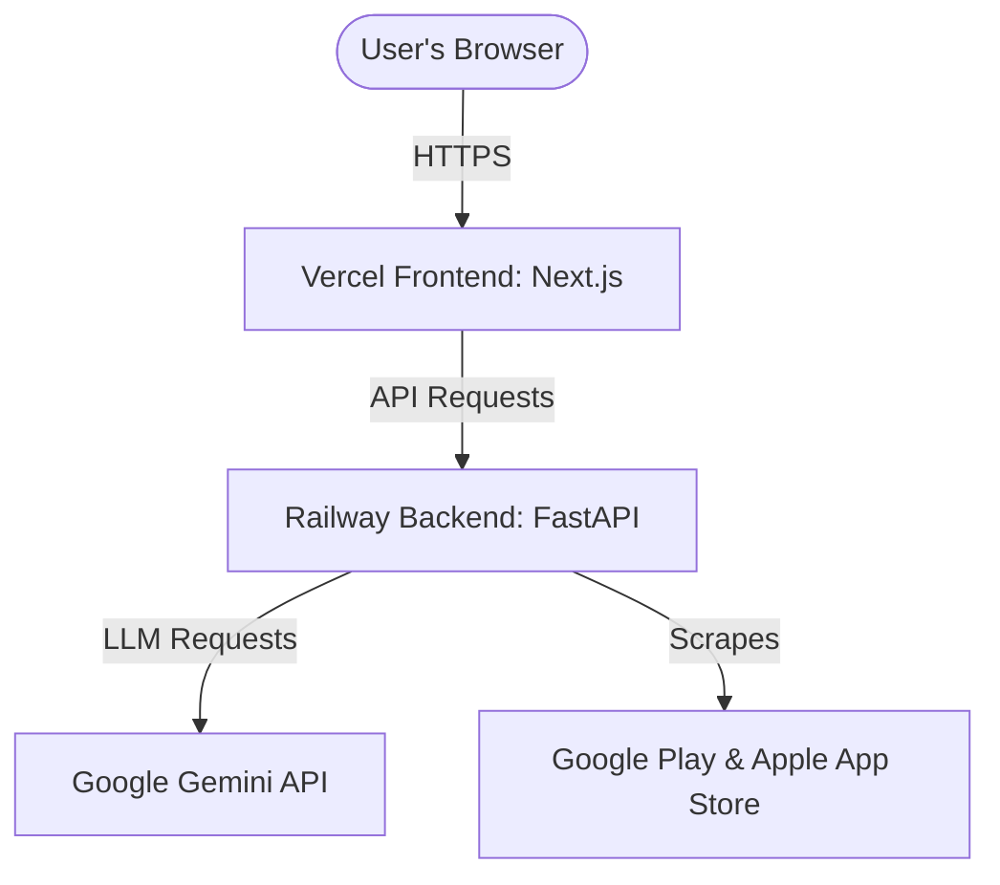

# 🚀 Deployment Plan — Blinkit Insight Analyser

This document details the step-by-step procedure to deploy the **Blinkit Insight Analyser** in a production environment. The architecture consists of:
1. **Frontend:** Next.js application deployed on **Vercel**.
2. **Backend:** FastAPI Python application deployed on **Railway**.

---

## 🏗️ Deployment Architecture Overview



---

## 🛠️ Step 1: Deploy Backend on Railway

Railway is an excellent platform for deploying Python/FastAPI services. Since the codebase is structured as a monorepo, we will configure Railway to build and run from the root directory but reference the backend directory explicitly.

### 1. Create a New Project on Railway
1. Go to [Railway.app](https://railway.app/) and sign in.
2. Click on **New Project** -> **Deploy from GitHub repo**.
3. Select your repository: `Blinklt-Insight-Analyser`.
4. Once added, click on the service to open its settings.

### 2. Configure Service Settings
Under the **Settings** tab of the service, configure the following:

* **Root Directory:** Keep this as `/` (the repository root).
* **Custom Build Command:**
  ```bash
  pip install -r backend/requirements.txt
  ```
* **Custom Start Command:**
  ```bash
  uvicorn backend.main:app --host 0.0.0.0 --port $PORT
  ```

> [!NOTE]
> We keep the root directory as `/` because the backend files use package-prefixed imports like `from backend.config import settings`. Running from the root ensures Python includes `backend` in its module search path (`PYTHONPATH`).

### 3. Add Environment Variables
Navigate to the **Variables** tab of the service and add the following variables:

| Variable Name | Value | Description |
| :--- | :--- | :--- |
| `GEMINI_API_KEY` | `your_gemini_api_key_here` | Your Google Gemini API Key. |
| `ALLOWED_ORIGINS` | `https://your-frontend-domain.vercel.app` | The production URL of your Vercel frontend (comma-separated list if multiple). |
| `PORT` | `8000` | The port the FastAPI service will listen on (Railway automatically overrides this). |

### 4. Expose the Service Publicly
1. In the service dashboard, go to the **Settings** tab.
2. Scroll to the **Environment** section and click **Generate Domain** (or add your custom domain).
3. Copy the generated URL (e.g., `https://blinkit-insight-analyser-production.up.railway.app`). You will need this for the frontend configuration.

---

## 💻 Step 2: Deploy Frontend on Vercel

Vercel is the native platform for Next.js applications and handles build optimizations automatically.

### 1. Import Project to Vercel
1. Go to [Vercel.com](https://vercel.com/) and sign in.
2. Click **Add New** -> **Project**.
3. Import your repository: `Blinklt-Insight-Analyser`.

### 2. Configure Build and Project Settings
During the configuration step, customize the following settings:

* **Framework Preset:** `Next.js`
* **Root Directory:** Edit this and set it to `frontend`.
* **Build Command:** `next build` (Vercel default)
* **Output Directory:** `.next` (Vercel default)

### 3. Configure Environment Variables
Under the **Environment Variables** section, add:

| Key | Value | Description |
| :--- | :--- | :--- |
| `NEXT_PUBLIC_API_URL` | `https://your-railway-domain.up.railway.app` | The public URL of the deployed Railway backend service. |

### 4. Deploy
1. Click **Deploy**.
2. Once the build completes, Vercel will provide a live production URL (e.g., `https://blinkit-insight-analyser.vercel.app`).

---

## 🔒 Step 3: Secure CORS and Validate Connection

To prevent unauthorized domains from making API calls to your backend, cross-reference the URLs:

1. Update the `ALLOWED_ORIGINS` variable in your **Railway** backend to include the exact Vercel production URL:
   ```env
   ALLOWED_ORIGINS=https://blinkit-insight-analyser.vercel.app
   ```
2. Redeploy the backend if necessary.
3. Open your browser, navigate to your Vercel deployment URL, and test:
   * Try entering a Play Store App ID (e.g., `com.grofers.customerapp`) or uploading a CSV file.
   * Verify that the sentiment charts, Opportunity Matrix, and dynamic themes load successfully from the live API.

---

## ⚠️ Important Considerations: Ephemeral Filesystem

> [!WARNING]
> **Railway containers have an ephemeral filesystem.**
> By default, the backend saves processed review runs as JSON files in the [data/processed/](file:///d:/PM%20Fellowship%20(Projects)/1_Grad_Project/BlinkIt%20Insight%20Analyser/data/processed) folder.
> When Railway redeploys or restarts the container, these local JSON files will be deleted, and the history page will reset to the pre-packaged seed data.

### How to achieve persistent history in production (Optional Upgrade)
If you require long-term persistence for your runs history in production, follow these steps to migrate from file-based storage to a database:

1. **Spin up a PostgreSQL Database on Railway:**
   * In your Railway project dashboard, click **New** -> **Database** -> **Add PostgreSQL**.
2. **Retrieve Connection URI:**
   * Copy the database connection URL (`DATABASE_URL`).
3. **Update Backend Storage Layer:**
   * Update [backend/main.py](file:///d:/PM%20Fellowship%20(Projects)/1_Grad_Project/BlinkIt%20Insight%20Analyser/backend/main.py) to read/write from the PostgreSQL database using SQLAlchemy or databases library when a `DATABASE_URL` environment variable is defined.
